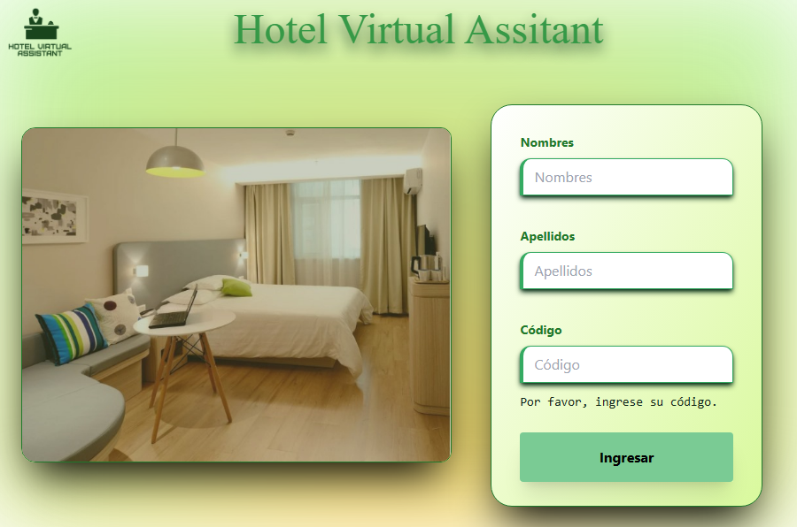
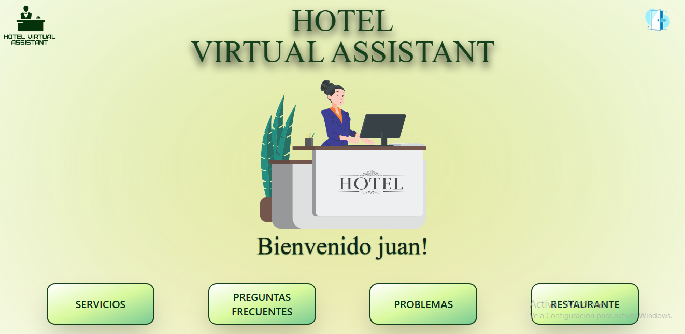

<div align='center'>
 <h1><em>HOTEL VIRTUAL ASSISTANT</em></h1>
  
 <p>  </p>
 <p>  </p>
<p align='justify'>
Hotel Virtual Assistant, es una aplicación web que transforma la experiencia hotelera. Realiza pedidos, reserva en el restaurante, informa problemas y gestiona reservas sin necesidad de contacto con recepción. Con una interfaz más intuitiva, brinda privacidad y autonomía para una estancia cómoda y personalizada. Descubre un nuevo nivel de conveniencia y eficiencia en tu viaje con Hotel Virtual Assistant.
</p>
</div>

DEMO: [https://youtu.be/2-6Xt6ees0g?si=UvryPNYhz4kc5iN9](https://youtu.be/2-6Xt6ees0g?si=UvryPNYhz4kc5iN9)

## Tecnologías

Asegúrate de tener las siguientes tecnologías y dependencias antes de ejecutar el proyecto:

- 
- 
- 
- 
- 
- 
- 

## Instalación

### Getting Started

> To deploy your application on-premises, you must follow the steps below.
>
> > Clonar el repositorio

```sh
 git clone https://github.com/juanRCode/Project-FAQ-accordion.git
```

> > Instalar el paquete de modules (npm)

```sh
 npm install
```

> > Visualizar la app

```sh
// mode development
 npm run dev
// final mode
 npm run start
```

## Screenshots del proyecto

Pagina del login y dashboard principal.

<div align="center">
  
   
</div>

## Diagrama de flujo

<div align="center">
  
</div>

## Arbol del proyecto

<div align="center">
  
   
</div>

## Contactos

Juan Ramirez

> Linkedin : [@juan Ramirez](https://www.linkedin.com/in/juan-ramirez-490b84271/)
> Instagram : [@juanrcoder](https://www.instagram.com/juanrcoder/)

Jhony Arana

> Linkedin: [@Jhony Arana](https://www.linkedin.com/in/jhony-arana-carranza-a103b350/)
> Github: [Jharanza](https://github.com/Jharanza)

Oscar Morales

> Linkedin: [@Oskar Morales](https://www.linkedin.com/in/oskarmorales/)
> Github: [0skarmp](https://github.com/0skarmp)

Link del proyecto: [http://localhost:3004](http://localhost:3004)

## Licence
- Este proyecto está bajo la Licencia MIT - ver el archivo [LICENSE](LICENSE) para más detalles.
- Creacion del proyecto 11-12-2023
